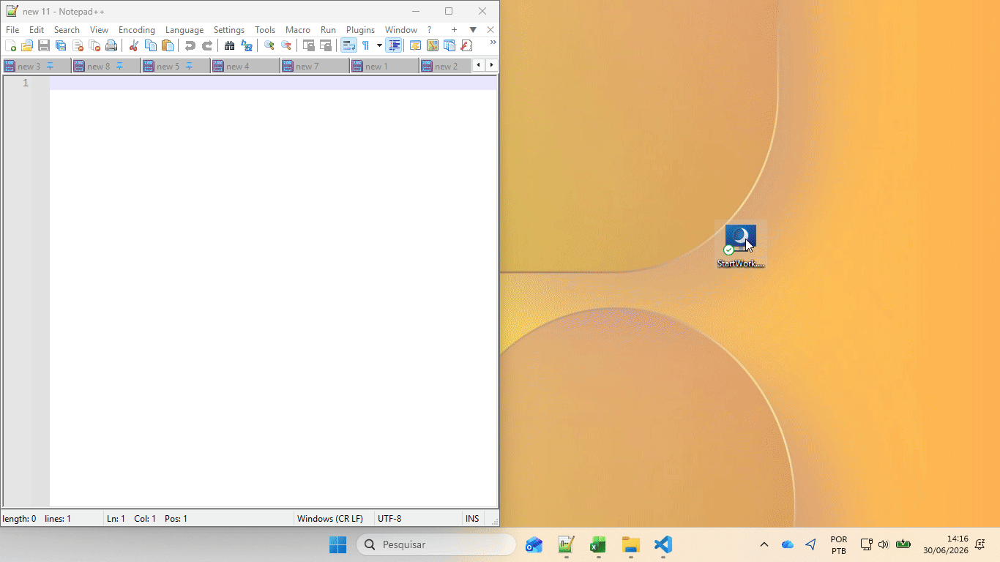

# 🚀 StartWork

## 🎥 Demonstração

  

---
## 📌 Automação pessoal para preparação do ambiente de trabalho e estudo.
O StartWork é uma aplicação Console desenvolvida em C#/.NET com o objetivo de automatizar a preparação do ambiente de trabalho.
---
## Com um único clique (ou automaticamente na inicialização do Windows), a aplicação:
* Fecha aplicações previamente abertas;
* Abre Outlook e Microsoft Teams;
* Abre o Microsoft Edge com as abas configuradas;
* Realiza o login automático no Salesforce;
* Mantém logs da execução;
* Possui configuração externa via JSON.
---
## 🛠 Tecnologias
* .NET 10
* C#
* JSON
* PowerShell
---
## Estrutura
* Core
    * * Config.cs
    * * Logger.cs
* Services
    * * Navegador.cs
    * * Processos.cs
    * * Salesforce.cs
* Program.cs
* config.json
---
## Configuração
{
  "InicioTrabalho": "08:00",
  "FimTrabalho": "18:00",

  "LinksTrabalho": [
      "...",
      "..."
  ],

  "LinksEstudo": [
      "...",
      "..."
  ]
}

---

## Melhorias futuras
Perfis (Trabalho, Estudo, Cliente)
Ícone na bandeja do Windows
Interface gráfica (WPF ou WinUI)
Instalador

---

## 👨‍💻 Autor

**Vanderluiz Oliveira**
